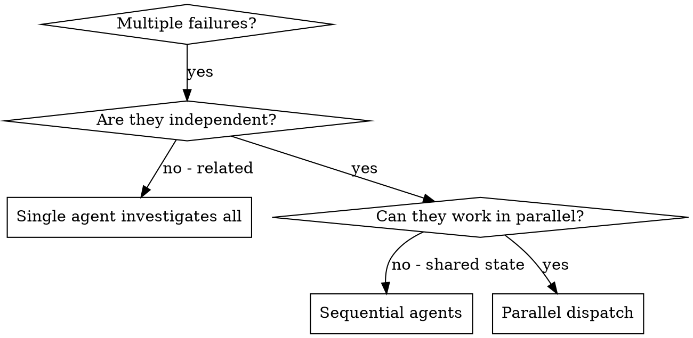

# Integration Examples

## Example: 6 failures across 3 files

**Scenario:** Major refactoring left tests broken in three subsystems.

**Failures:**

- `agent-tool-abort.test.ts` — 3 failures (timing issues)
- `batch-completion-behavior.test.ts` — 2 failures (tools not executing)
- `tool-approval-race-conditions.test.ts` — 1 failure (execution count = 0)

**Decision:** Independent domains — abort logic is separate from batch completion is separate from race conditions. Dispatch in parallel.

**Dispatch:**

```
Agent 1 → Fix agent-tool-abort.test.ts
Agent 2 → Fix batch-completion-behavior.test.ts
Agent 3 → Fix tool-approval-race-conditions.test.ts
```

**Results:**

- Agent 1: replaced timeouts with event-based waiting
- Agent 2: fixed event structure bug (threadId in wrong place)
- Agent 3: added wait for async tool execution to complete

**Integration:** All fixes independent, no conflicts, full suite green.

## Decision Flow



## Dispatch Syntax

```typescript
// In Claude Code / AI environment
Task("Fix agent-tool-abort.test.ts failures")
Task("Fix batch-completion-behavior.test.ts failures")
Task("Fix tool-approval-race-conditions.test.ts failures")
// All three run concurrently
```
